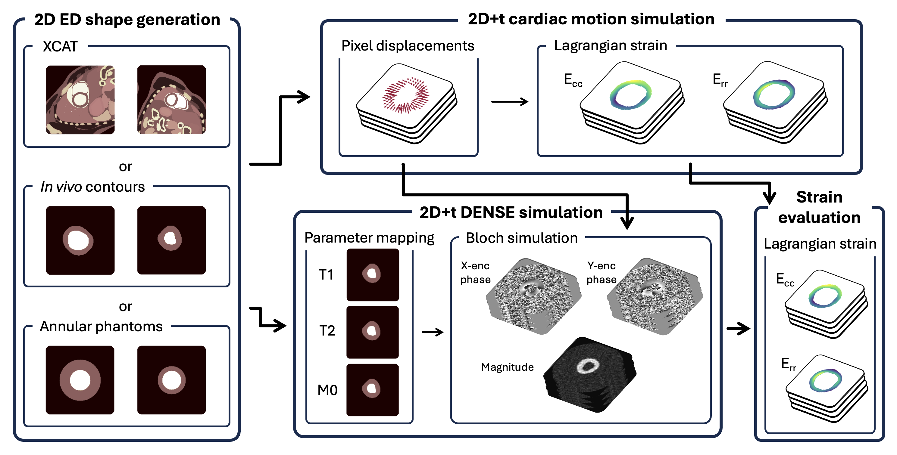

# DENSE_Sim

This repository contains code to generate cardiac cine DENSE images with associated high-resolution ground-truth strain.
It implements the methods described in the JCMR paper https://doi.org/10.1016/j.jocmr.2025.101866 by Barbaroux et al.


     
## Installation & set-up

You can install the required packages using the [requirements file](docs/install.md).

The DENSE simulation module can create a [DENSEanalysis](https://github.com/denseanalysis/denseanalysis) workspace using the simulated images and ground-truth LV contours. This part calls some Matlab code, for which the Matlab engine package for Python needs to be installed separately: https://uk.mathworks.com/help/matlab/matlab_external/call-matlab-functions-from-python.html.

To finish setting up, as in https://github.com/mloecher/tag_tracking, this code requires a C library to be built for gridding. Running `python setup.py build_ext --inplace` should build everything. If you are using XCode on Mac for C compiling, replace `setup.py` with `setup_xcode.py` (this disables openMP because stock Mac XCode doesn't support it).

## Pipeline

### I. Code structure

- [configs/](configs/): config file examples. Most scripts can be run using ```python {script.py} -c {config_path.yaml}```.
- [data_samples/](data_samples/): examples of generated data using the pipeline modules.
- [main/](main/): main code.
- [visualization/](visualization/): simple script to visualise 2D/2D+time sequences using matplotlib. Can easily be extended.
  
### II. Background generation

This first module is intended to create end-diastolic (ED) LV masks and background tissues. Currently, we support three options:
  - using [XCAT](https://pmc.ncbi.nlm.nih.gov/articles/PMC2941518/): this requires to have pre-run single-frame XCAT simulations, obtaining .bin activation files to act as base tissue segmentations (requires a license to do so).
  - using in-vivo contours: extract the end-diastolic frame of a 2D+time LV mask NIfTI file.
  - generating annular phantoms

The base classes can be extended to generate/process custom LV contours. Examples of expected input/output data formats can be seen in [data_samples](data_samples/).

### III. Cardiac motion

From generated LV masks, cardiac motion in time can be generated. This work extends previous work from Loecher et al. for tagging (https://github.com/mloecher/tag_tracking).

Dilation can be applied to the LV mask, and twist angle, general motion scaling and radial strain transmural trend can be parameterized. 

### IV. DENSE generation

Previously generated high-res motion can be used to generate DENSE images. Capabilities have been added to support spiral sampling, k-space noise, phase cycling. The specific spiral pattern, ke, kd and echo time can be changed, alongside T1, T2 and S0 parameters for the different tissues (can be edited to match 1.5T or 3T). This work extends previous work from Loecher et al. for tagging (https://github.com/mloecher/tag_tracking).

> [!CAUTION]
> The code is currently set-up and validated for spiral sampling with interleaves. It needs to be cleaned up and updated to support flexibility with the sampling pattern wanted (ie adding Cartesian sampling and defining proper sampling classes easily extendable).

### V. Strain processing

High-res ground-truth strain from generated displacements and corresponding low-res strain at the DENSE resolution can be generated from scripts in [process_strain/](main/process_strain/).

## TO-DO

- [ ] Refactor legacy code for consistency across modules
- [ ] Refactor motion and DENSE modules into classes for increased flexibility
- [ ] Package code to support independent external use
- [ ] Extend supported data formats
- [ ] Extend to RV (partly implemented)
- [ ] Add background tissues option into the DENSE module
- [ ] Add effective magnitude SNR calculation after DENSE generation to save into output config
- [ ] Add retry routine by lowering the global displacement scaling parameter in the motion module (currently, if simulation leads to no blood pool at a certain frame, simulation is considered failed and skipped).

## Citation

Please cite the corresponding journal paper if you found this work useful:

```
@article{BARBAROUX2025101866,
title = {DENSE-SIM: A modular pipeline for the evaluation of cine DENSE images with sub-voxel ground-truth strain},
journal = {Journal of Cardiovascular Magnetic Resonance},
pages = {101866},
year = {2025},
issn = {1097-6647},
doi = {https://doi.org/10.1016/j.jocmr.2025.101866},
url = {https://www.sciencedirect.com/science/article/pii/S1097664725000286},
author = {Hugo Barbaroux and Michael Loecher and Yannick Brackenier and Karl P. Kunze and Radhouene Neji and Dudley J. Pennell and Daniel B. Ennis and Sonia Nielles-Vallespin and Andrew D. Scott and Alistair A. Young},
keywords = {Cardiac, MRI, Strain, DENSE, Image synthesis},
```
